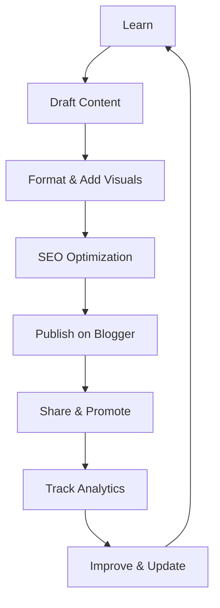

# 🔄 Aidivehub Blog – Process Flow  
*(Aligned with BRD Sections 11–14)*

## High‑Level Flow  
Learn → Draft → Format → SEO → Publish → Share → Track → Improve

## Mermaid Diagram  

```mermaid
flowchart TD
A[Learn] --> B[Draft Content]
B --> C[Format & Add Visuals]
C --> D[SEO Optimization]
D --> E[Publish on Blogger]
E --> F[Share & Promote]
F --> G[Track Analytics]
G --> H[Improve & Update]
H --> A
```
